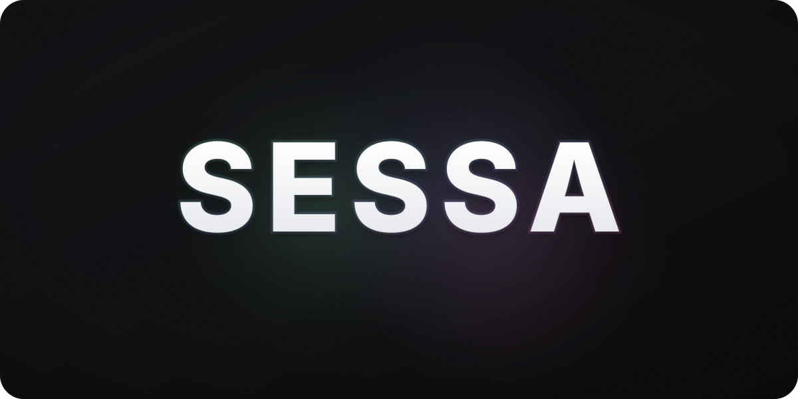
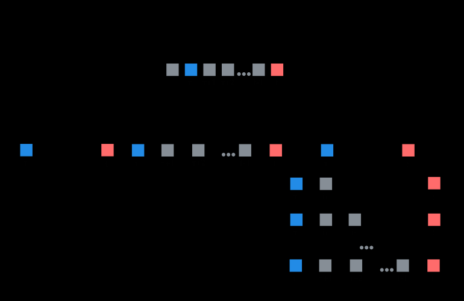

# Sessa: Selective State Space Attention

<p align="center">
  <a href="https://arxiv.org/abs/2604.18580">
    
  </a>
</p>

<p align="center">
  
</p>


## About

Sessa is a decoder architecture that integrates self-attention into a recurrent feedback pathway.

It combines input-dependent attention routing with feedback-based recurrent aggregation, aiming to improve long-context information preservation and integration beyond standard Transformers and SSM-based models such as Mamba.

<p align="center">
  
</p>

## Installation

```bash
git clone https://github.com/LibratioAI/sessa.git sessa-repo
cd sessa-repo
python -m pip install -e .
```

> [!NOTE]
> If `from sessa.layer import SessaLayer` still raises `ModuleNotFoundError: No module named 'sessa'` in a notebook, restart the kernel/runtime and try again.


### Optional: FlashAttention

This repo supports FlashAttention if available.  
Official FlashAttention repository: https://github.com/Dao-AILab/flash-attention

Install it separately according to the official instructions (installation depends on your CUDA/PyTorch setup).
If FlashAttention is not installed, the code falls back to a reference attention implementation.

> [!IMPORTANT]
>    
>
> FlashAttention is **disabled by default**. Enable it with `use_flash=True`.

## Quickstart

```python
import torch
from sessa.layer import SessaLayer  

# ---- Core dimensions ----
B = 2          # batch size
T = 128        # sequence length 
D = 512        # model width

# ---- Mixer settings ----
use_flash = True    # enable FlashAttention path if available + CUDA
use_forward_rope = True   # toggle RoPE on the forward attention branch
n_heads = 8         # number of heads for forward attention
ln_eps = 1e-5             # LayerNorm epsilon
gamma_max = 0.999         # bounds feedback gain: |gamma_t| <= gamma_max < 1
# NOTE:
# - D must be divisible by n_heads
# - (D // n_heads) must be even 

# Optional: precompute masks up to this length 
max_len = 1024

layer = SessaLayer(
    D=D,
    n_heads=n_heads,
    max_len=max_len,
    ln_eps=ln_eps,
    use_flash=use_flash,
    use_forward_rope=use_forward_rope, 
    gamma_max=gamma_max,
)

# Input tokens: (B, T, D)
x = torch.randn(B, T, D)

# If you want FlashAttention to actually run:
# - move to CUDA
# NOTE: dtype can stay fp32; the mixer will cast q/k/v to bf16/fp16 for flash
# and cast the output back to the model dtype.
if use_flash and torch.cuda.is_available():
    x = x.cuda()
    layer = layer.cuda()

y = layer(x)  # (B, T, D)
print(y.shape)
```

## Citation

If you use this codebase or the ideas in the paper in your research, please cite Sessa: Selective State Space Attention.

```bibtex
@article{horbatko2026sessa,
  title         = {Sessa: Selective State Space Attention},
  author        = {Horbatko, Liubomyr},
  year          = {2026},
  eprint        = {2604.18580},
  archivePrefix = {arXiv},
  primaryClass  = {cs.LG}
}
```

## License

Licensed under the **Apache License, Version 2.0**. See [LICENSE](LICENSE).


